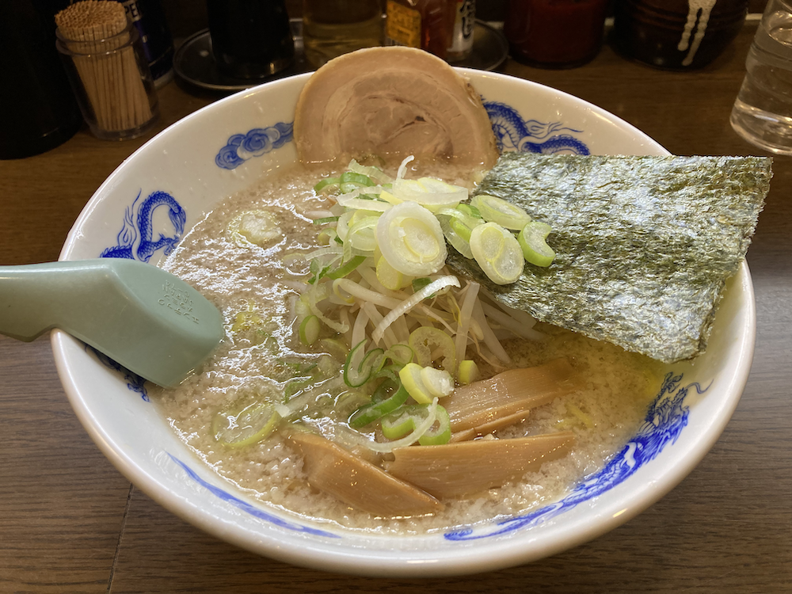

ボムです。
毎月第1・3土曜日に市川駅付近の公民館で勉強会を行っています。

今日はJavaScriptについて学びました。

次回は3月18日（土）15：00〜18：00です。
読み合わせは、MDN Web Docs > ウェブ入門 > JavaScriptの基本　ウェブサイトの例を膨らませる からです。

ちなみにですが、、、

4/15,16に、ScalaMatsuri 2023が開催されます。
もしご興味あれば、チェックしてみてください。オンライン開催みたいです。

ラーメン食べて帰りました。

